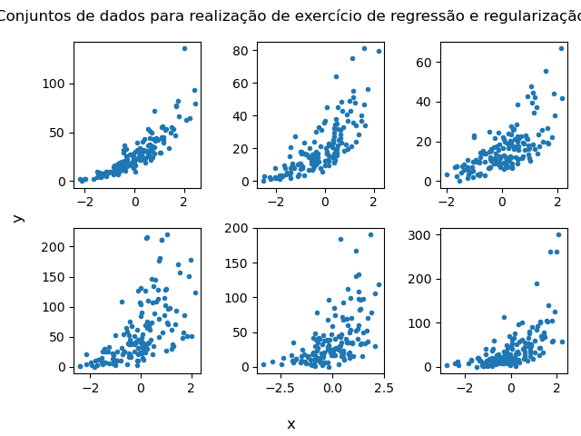

# Exercício de regressão e regularização
### Os seis conjuntos de dados plotados foram produzidos com a rotina ```sklearn.datasets.make_regression()```.
### Aproxime funções com uma rede MLP para cada conjunto, dividindo as amostras em grupos de treino e validação, utilizando as de treino para regressão e de validação para avaliação de sobreajuste. Em cada caso, reporte as métricas de desempenho erro quadrático médio (MSE) e coeficiente de determinação (R²). Obtenha os resultados sem regularização e com as regularizações L1 e L2.



